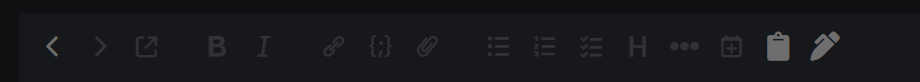
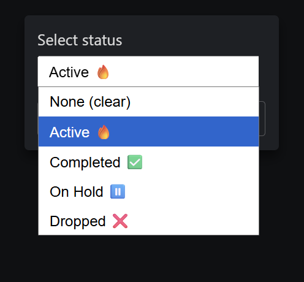
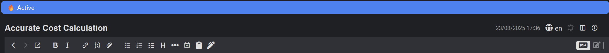

# Note Status Plugin for Joplin

A Joplin plugin that lets you assign a **status** to any note — Active, Completed, On Hold, Dropped — and displays it as a badge above the editor.

---

## Features

- **Toolbar Button & Dialog**:  
  Click the toolbar button to open a status picker dialog. Select a status and press OK. The badge above the editor updates automatically.

- **Inline Badge**:  
  Shows the current note’s status above the editor. Automatically updates when switching notes.

---

## Installation

1. Open Joplin → Tools → Options → Plugins
2. Search for `Note Status` and install
3. Enable the plugin (If not already)

---

## Usage

You can use this Plugin to get the Inkdrop like status functionality for your notes.

### Toolbar Button & Dialog
Click the toolbar button

 to open the dialog and select a status.
  

### Inline Badge
  
The badge shows the current status of the note. Updates automatically on note selection.

---

## Support

If you encounter any issues, please open an issue on [GitHub](https://github.com/DeeptangshuSaha/joplin-plugin-note_status/issues).

---

## Contributing

Contributions are welcome! Fork the repo and submit a pull request.

---

## Changelog

### [1.0.0] - 2025-08-23
- Initial release
- Toolbar button with dialog to set note status
- Inline badge above editor

### [1.0.1] - 2025-08-23
- Polishing files for proper publish
